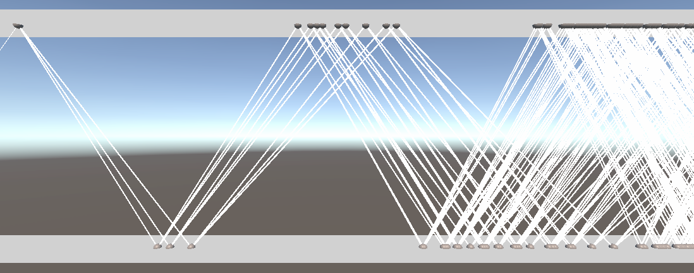

# Physics Ray Tracing Simulator
This is a novel scientific ray tracer which aims to leverage the benefits of data-oriented design to deliver state of the art simulation of physics instruments' background.
Modularity, performance and ease of use is the focus, while keeping the types of physics the ray simulates flexible.

## Novel features
Compared to other ray tracing simulator program used in physics this simulator has the following novel features:

### Data oriented design
    Written with Unity's DOTS package which allows for high performance and scalability out of the box.
    We can seperate physics from the computer science and allow people who are expert in physics, not programming, to write simulations with state of the art performance.

### One to many scattering
    Each in-going ray can create multiple outgoing rays. Beside allowing for more kinds of physics to be simulated, this also helps performance as interaction often yield multiple outgoing rays naturally.

### Modular instrument design
    Each part of the instrument consist of modular components. 
    This allows for strong maintainable modules that are reused and for building instruments without writing code but instead by using Unity's drag and drop interface

## Future Goals
    Stronger Test setup
    Comparative performance tests
    Finish job model for interactions
    Rethink authoring to make sure unphysical setups are harder to make
    Handle multiple kind of interaction on the same object
    Better real life models implemented